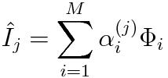
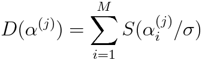
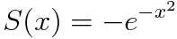
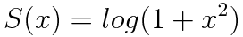
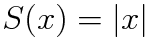
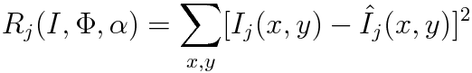
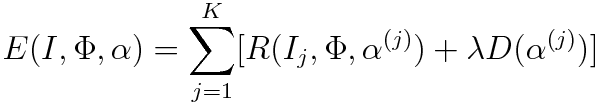

<link href="style.css" rel="stylesheet"></link>

<h1>README: Unsupervised Learning of Fundamental Music Features</h1>
<h3>Richard Lange</h3>

---

Iterative Sparse Coding
----

The algorithm I implemented is called _Iterative Sparse Coding_ (ISC), and was introduced in a [1996 paper by Olshausen and Field][olshausen]. My corresponding code is `par_iterative_sparse_coding.m`. (It used to be `iterative_sparse_coding.m` but then I added parallelization and stopped updating the old one with other changes). Here is an overview of how the algorithm works:

Given a set training images, `I`, learn a set of _basis functions_ (features), ![][phi],  that best _sparsely_ reconstruct the original images via linear combination. Here, 'sparseness' refers to the size of the reconstruction weights, ![][alpha]. The number of features to be learned is set by the user beforehand.

_Reconstruction_ of image `j` is defined as follows:

A vector of ![][alpha] is learned for *each* image using the given ![][phi].

The denseness (negative sparseness) of ![][alpha] is defined as 

where `S(x)` is a function that is smallest at `x=0`. ![][sigma] is a hyperparameter. The authors proposed three options (the third is the most intuitive, the first two work nicer with math):

  

The algorithm is fairly simple: it minimizes error `E`, defined as a weighted sum of _reconstruction error_ and _denseness_. Reconstruction error for image `j` is simply

The error function is, then

![][lambda] is a hyperparameter that controls the relative weight of `R` and `D`.

A common question I get when explaining this algorithm is "why does sparseness matter?" My intuition for this is that the fewer features it takes to reconstruct a training example, the more those features defined something fundamental. If this is done for all images, the features then define something fundamental and *shared* between images.

The significant result that Olshausen and Field found is that this simple algorithm successfully generates good _convolutional features_ for image processing, despite being defined in terms of _sums_ for reconstruction. This is almost surprising, but makes sense from a mathemagical/intuitive perspective.

---

How to run the code
---

__main algorithm__

To run the main algorithm or do heavy computations, `ssh` into the [Thayer Computing Cluster](https://wiki.thayer.dartmouth.edu/display/computing/Linux+Services) and run matlab from the command line using `matlab -nodisplay` (most of the scripts that required this heavy parallelization automatically save the results to `saved data/remote`).

First, run `init`. After this, you can just use `run` to run the full algorithm with all default options. The following variables can be changed prior to running `run`:

* `composers` - cell array of composer names, e.g. `{'joplin', 'debussy', 'beeth'}`. The choices are the names of directories in `midi files`. Default is `{'joplin', 'chopin'}`
* `parallel` - a boolean determining whether or not to use parallelization. default is false.
* `pool` - number of cores to use in parallelization (used in `matlabpool(pool)`). Only works if `parallel` is true. default is 2 (thayer servers can go up to 8).
* `N_HARMONY` - number of times to apply harmony boosting. Default is 0.
* `sigma` - A hyperparameter of the model indirectly controlling the learning rate of the weights for each image reconstruction. Default to the average variance of the training images.
* `lambda` - A hyperparameter of the model. Lambda controls the priority between reconstruction error and denseness error.
* `outer` - max number of outer loops (within each outer loop, it does gradient descent on ![][alpha] in terms of reconstruction then takes one step of gradient descent for ![][phi]. Default is 4000 to 5000.
* `inner - max number of iterations for gradient descent on ![][alpha] (usually converges in under 20, but default is 60).
* `NUM_IMG_PER_PHI_UPDATE` - As mentioned in the fine print of Olshausen and Field's paper, we don't need to try to reconstruct *all* the images before updating ![][phi]. This parameter controls how many train images to look at per update of ![][phi]. Default is 100. However, I got best results before adding this option in. Might as well set it to `Inf`.

Now for actually running it.. Note that, due to some strange parallelization bugs, larger songs can't be loaded in parallel. This can be done separately by calling `get_song_matrices` after specifying `composers`. Here is a typical command line session (on remote server). 

    >> init
    >> get_song_matrices; % takes a while, but sometimes breaks parallel stuff if the songs are large, so best to do it here
    >> parallel = true;
    >> pool = 8;
    >> outer = 4500;
    >> NUM_IMG_PER_PHI_UPDATE = Inf;
    >> run; % this is the part that takes a long time (30 min to 150 min depending on num features, etc..)

__test scripts__

The main test script (and the only one that I can guarantee works) is `test_iterative_sparse_encoding.m`. With nothing else specified, this will do the grating test that I presented in the poster presentation; it will generate 25 training images made from the sum of 5 random gratings and run ISC.

The other important test is `test_classifier.m`, which uses the results of feature-generation (must have `B_ISC` and `B_PCA` in workspace) and convolves them with small samples of songs from the current composers. Using a hack-y version of n-fold cross validation, it does a bunch of classification trials and plots the results. Note: this was added after the poster presentation and may be buggy. Also the results are inconclusive.

__plots__

Open the actual Matlab application and load the saved results. Type `plots=true;` in the command window, then open scripts like `run_ISC`, `run_PCA`, or `test_iterative_sparse_encoding` and run the cells individually to get plots.

---

Data format/important variables
---

* `song2d_cell` - a cell array containing all 2D song matrices. Each song matrix has pitch on columns and beat on rows. In other words, `song(340:345, 61)=1` sets the note with pitch 61 to be held for 5 beats, probably somewhere in the middle of the song..
* `B_ISC` - cell array of features learned by ISC
* `A_ISC` - weight matrix for reconstruction with features `B_ISC`. KxM, where there are K training images and M features.
* the above two also will be computed for PCA when you call `run`

---

What I did
----

I wrote all code from scratch, except the midi_lib, which I downloaded from [here](https://www.jyu.fi/hum/laitokset/musiikki/en/research/coe/materials/miditoolbox/). I downloaded the midi files from two sources: [ragtime](http://www.trachtman.org/ragtime/) and [classical](http://www.piano-midi.de/midi_files.htm).

PATCH_3Darray is a 3D matrix visualization function I downloaded [here](http://www.mathworks.com/matlabcentral/fileexchange/28497-plot-a-3d-array-using-patch). Since I converted from 3D song representations to 2D, I no longer use this.

[alpha]: images/alpha.png
[phi]: images/phi.png
[lambda]: images/lambda.png
[sigma]: images/sigma.png

[olshausen]: http://www.nature.com/nature/journal/v381/n6583/abs/381607a0.html